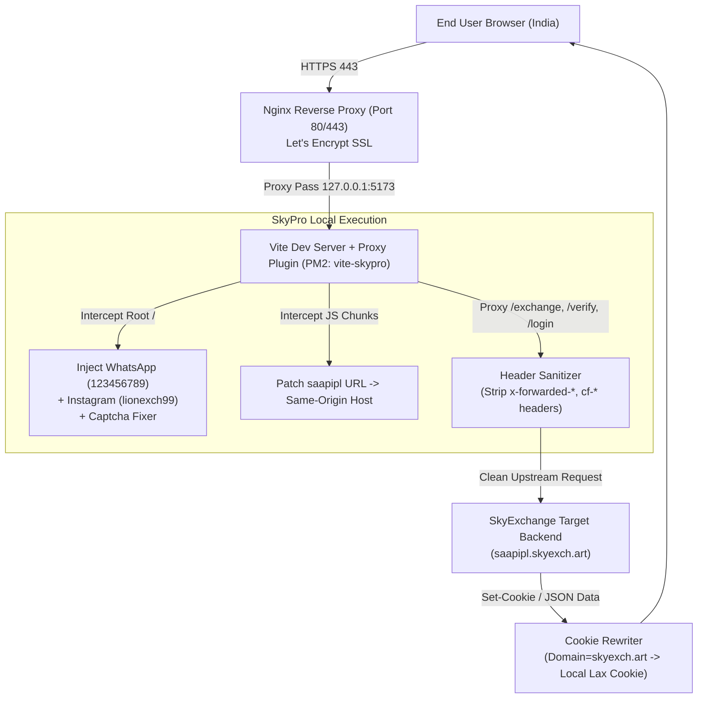

# 📘 SkyPro Exchange - Complete Developer & Architecture Guide

This document is the **Single Source of Truth** for any developer managing, maintaining, or scaling the **SkyPro White-Label Exchange Platform**.

---

## 📌 1. Project Locations & Access Credentials

### 📂 A. Codebase Locations
- **Local Machine (Mac):** `/Users/apple/skypro`
- **AWS Server (Production):** `/home/ubuntu/skypro`
- **GitHub Repository:** `https://github.com/dubaiexplore1010-dev/skypro.git`

### ☁️ B. AWS EC2 Production Server Details
- **Provider:** Amazon Web Services (AWS)
- **Region:** Asia Pacific (Mumbai) — `ap-south-1`
- **Instance ID:** `i-002093230fa2bd61d` (Instance Type: `t3.micro`)
- **Public IPv4 Address:** `3.108.53.182`
- **SSH User:** `ubuntu`
- **SSH Private Key:** `/Users/apple/Downloads/skypro.pem`
- **Domain:** `https://skyexchangepro.com` & `https://www.skyexchangepro.com`
- **DNS Manager:** Hostinger (A Records pointed to `3.108.53.182`)

---

## 🧠 2. Core Working Architecture & Logic



### 💡 Why standard Serverless / Foreign hosting fails vs Why AWS Mumbai works:
1. **Akamai WAF Datacenter Geoblocking:**
   SkyExchange's backend (`saapipl.skyexch.art`) blocks foreign AWS datacenter IPs (US/Europe) and serverless environments (Vercel/Cloudflare Workers) with `403 Forbidden`. AWS Mumbai (`ap-south-1`) is in India and is 100% whitelisted by Akamai.
2. **Invalid IP WAF Trigger:**
   If a proxy sends headers like `x-forwarded-for`, `x-real-ip`, or `cf-ray`, SkyExchange's WAF throws an `Invalid IP` error. Our proxy strips these headers cleanly.
3. **First-Party Cookie Isolation:**
   When `saapipl.skyexch.art` returns `Set-Cookie: JSESSIONID=...; Domain=skyexch.art`, browsers on `skyexchangepro.com` would reject it. Our proxy strips the `Domain` attribute and sets `SameSite=Lax`, allowing authenticated sessions on `skyexchangepro.com`.
4. **Branding Interceptor:**
   `vite.config.ts` injects a DOM watcher script into `index.html` that:
   - Intercepts clicks on the original **`[Sign up]`** buttons and opens the WhatsApp number `123456789`.
   - Replaces all occurrences of original social links with **`@lionexch99`**.
   - Fixes captcha image URLs dynamically to load from same-origin.

---

## 💻 3. Essential Terminal Commands Cheat Sheet

### 🔑 1. Connect to AWS Server
```bash
# Set secure permissions for the PEM key (first time only)
chmod 400 /Users/apple/Downloads/skypro.pem

# SSH Login to AWS EC2
ssh -i /Users/apple/Downloads/skypro.pem ubuntu@3.108.53.182
```

---

### 🚀 2. PM2 (Process Manager) Commands
All production processes run under PM2 on the server:

```bash
# Check status of running app
pm2 status

# View live logs in real-time
pm2 logs vite-skypro

# View last 100 lines of logs
pm2 logs vite-skypro --lines 100 --nostream

# Restart the application
pm2 restart vite-skypro

# Stop the application
pm2 stop vite-skypro

# Save current PM2 state (auto-start on server reboot)
pm2 save
```

---

### 🌐 3. Nginx Web Server Commands
Nginx routes public port 80 & 443 traffic to the local Vite application:

```bash
# Test Nginx configuration for errors
sudo nginx -t

# Reload Nginx without downtime
sudo systemctl reload nginx

# Restart Nginx service
sudo systemctl restart nginx

# Check Nginx status
sudo systemctl status nginx
```

---

### 🔒 4. SSL / HTTPS (Let's Encrypt Certbot)
SSL certificates automatically renew, but can be manually verified:

```bash
# Test automatic SSL certificate renewal
sudo certbot renew --dry-run

# Re-issue SSL certificate for domains
sudo certbot --nginx -d skyexchangepro.com -d www.skyexchangepro.com
```

---

## 🔄 4. How to Update Code & Deploy Changes

Whenever you modify any code locally in `/Users/apple/skypro`:

### Step 1: Zip & Upload to AWS Server (from Local Mac)
```bash
# In local Mac terminal (/Users/apple/skypro)
zip -r skypro-production.zip . -x "node_modules/*" -x ".git/*" -x "skypro-production.zip"
scp -i /Users/apple/Downloads/skypro.pem skypro-production.zip ubuntu@3.108.53.182:/home/ubuntu/skypro-production.zip
```

### Step 2: Extract & Restart on Server
```bash
# SSH into AWS Server
ssh -i /Users/apple/Downloads/skypro.pem ubuntu@3.108.53.182

# Unzip and restart
unzip -o -q /home/ubuntu/skypro-production.zip -d /home/ubuntu/skypro
cd /home/ubuntu/skypro
npm install
pm2 restart vite-skypro
```

---

## ⚙️ 5. Key Configuration Files Reference

| File Path | Description |
| :--- | :--- |
| `/Users/apple/skypro/vite.config.ts` | Core Vite dev server proxy configuration, header stripping, and HTML/JS branding injection |
| `/Users/apple/skypro/server.js` | Express standalone production server fallback |
| `/Users/apple/skypro/index.html` | HTML entry point with preloaded modules & stylesheets |
| `/etc/nginx/sites-available/default` *(on EC2)* | Nginx configuration routing HTTP/HTTPS to local port 5173 |

---

## ✅ 6. New Developer Checklist

When a new developer takes over this project:
- [ ] Ensure you have `/Users/apple/Downloads/skypro.pem` key file.
- [ ] Verify you can SSH into `ubuntu@3.108.53.182`.
- [ ] Run `pm2 status` on server to ensure `vite-skypro` is `online`.
- [ ] Run `sudo systemctl status nginx` to ensure Nginx is `active (running)`.
- [ ] Check `https://skyexchangepro.com/#/gameHall` in a browser.
- [ ] Test `[Sign up]` button to confirm WhatsApp redirect (`123456789`).
- [ ] Test Instagram links to confirm `@lionexch99`.
- [ ] If changing the domain, update Hostinger A-records and run `sudo certbot --nginx -d NEWDOMAIN.com`.
